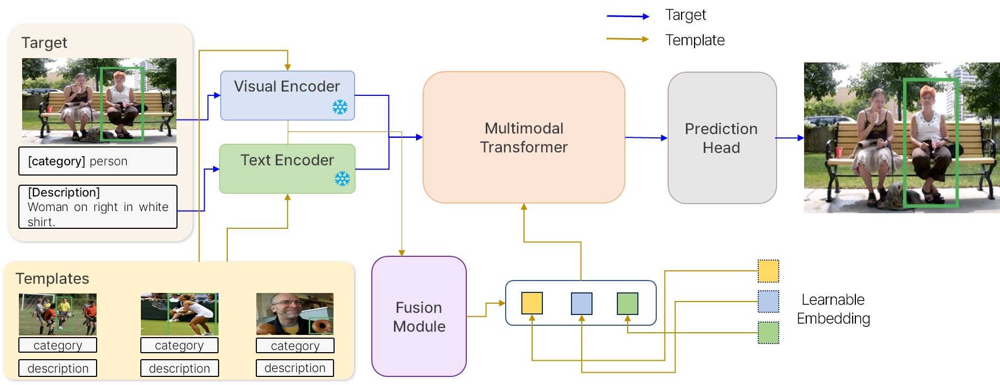
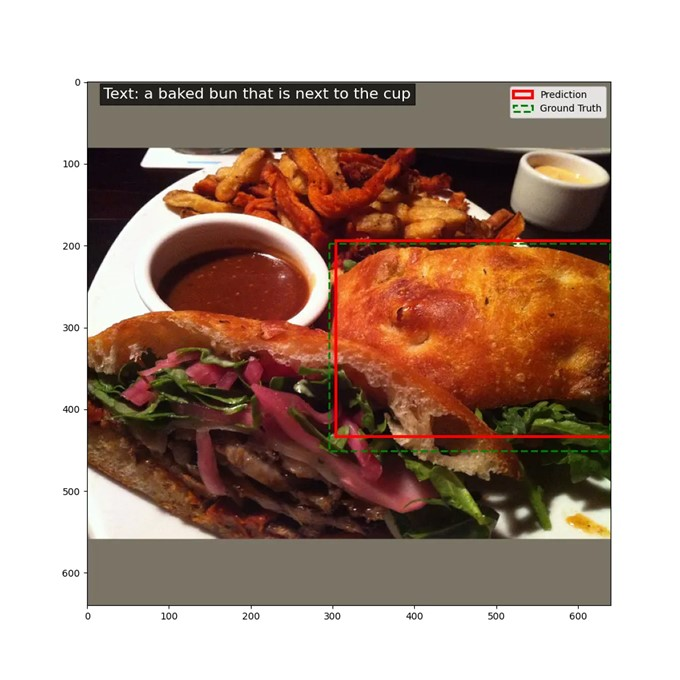

# Multimodal Few-shot Visual Grounding without Fine-tuning

This repository provides the code and experimental results for **Multimodal Few-shot Visual Grounding** without the need for fine-tuning. The proposed model architecture introduces an effective method for visual grounding using **few-shot learning** with the **Dynamic MDETR** model and enhances its performance using **multimodal prompts**, **cross-attention**, and **contrastive loss**.

## Table of Contents

- [Introduction](#introduction)
- [Framework](#framework)
- [Datasets](#datasets)
- [Methodology](#methodology)
- [Evaluation](#evaluation)
- [Results](#results)
- [Conclusion](#conclusion)
- [Future Works](#future-works)
- [Contributions](#contributions)

## Introduction

Visual grounding tasks aim to identify objects in images that correspond to a given textual query. Traditional methods rely on **large-scale datasets** and **fine-tuning** for every new class or domain, which is not ideal for few-shot learning scenarios.

Our research addresses these limitations by proposing a model that:
1. Performs **few-shot visual grounding** without fine-tuning.
2. Utilizes **learnable embeddings** to enable the model to generalize to unseen classes.
3. Enhances performance using **cross-attention mechanisms** and **contrastive learning** for better multimodal integration.

## Framework

The core architecture builds on **Dynamic MDETR** (Dynamic Multimodal Transformer Decoder for Visual Grounding). We integrate the following components:
- **Multimodal Prompts**: Each template is composed of image features, text features, and a learnable embedding.
- **Cross-Attention Fusion Module**: This module allows for stronger interaction between the image and text modalities through bidirectional cross-attention.
- **Contrastive Loss**: Helps to maximize the difference between different-class templates and minimize intra-class template differences, further improving few-shot generalization.

### Architecture Overview

### Key Modules:
1. **Multimodal Prompt**: Combines image, text, and learnable embeddings for the template-based few-shot grounding.
2. **Cross-Attention Mechanism**: Applies between image and text to improve template fusion.
3. **Contrastive Loss**: Enhances the distinction between same-class and different-class templates.

## Datasets

We utilize two main datasets for pre-training and fine-tuning the model:
- **Pre-training Dataset**: RefCOCO, Flickr30k
- **Fine-tuning Dataset**: RefCOCOg

### Dataset Statistics
| Dataset       | #Images  | #Refer Expressions | Train Classes | Eval Classes |
|---------------|----------|--------------------|---------------|--------------|
| RefCOCO       | 19,994   | 142,209            | 70            | 10           |
| Flickr30k     | 31,000   | 5 refer/image      | -             | -            |
| RefCOCOg      | 25,799   | 142,209            | 70            | 10           |

## Methodology

Our methodology introduces several key components for improving few-shot visual grounding:
1. **Multimodal Prompt Generation**: Templates are composed of visual and textual features combined with learnable embeddings.
2. **Cross-Attention Fusion**: By leveraging cross-attention between image and text features, the model achieves better multimodal integration.
3. **Contrastive Learning**: Helps differentiate between different-class templates while refining same-class templates.

### Loss Function:
We apply **contrastive loss** to maximize inter-class variability and minimize intra-class differences for more robust feature learning.

## Evaluation

We performed two primary evaluations:
1. **Template-based Performance Evaluation**: Analyzing the effect of including templates (support set) with different architectures, including **Dynamic MDETR**.
2. **Unseen Class Evaluation**: Evaluating model generalization on unseen classes using fusion and contrastive loss.

### Experimental Results:

| Methods                    | Backbone  | Support Set | Accuracy |
|-----------------------------|-----------|-------------|----------|
| TransVG                     | ResNet-101| No          | 67.02    |
| TransVG                     | ResNet-50 | No          | 66.56    |
| TransVG++                   | ResNet-50 | No          | 73.86    |
| GroundVLP                   | Vin-VL    | No          | 74.73    |
| Dynamic MDETR               | ResNet-50 | No          | 69.43    |
| **Dynamic MDETR + FS**      | ResNet-50 | Yes         | **83.6** |

### Unseen Data Few-shot Visual Grounding Results:
| Methods                    | Backbone  | Accuracy | AP   |
|-----------------------------|-----------|----------|------|
| Ours                        | ResNet-50 | 0.30     | 0.53 |
| Ours + Fusion Module (Fu)    | ResNet-50 | 0.39     | 0.58 |
| Ours + Contrastive Loss (Cl) | ResNet-50 | 0.38     | 0.60 |
| Ours + Fu + Cl               | ResNet-50 | 0.39     | 0.60 |

## Results

The model achieves a significant improvement in both accuracy and AP with the introduction of the **Fusion Module** and **Contrastive Loss**. The few-shot visual grounding performance is highly enhanced on unseen data with up to **9% increase in accuracy** and **7% increase in AP**.

### Visual Results:

Below are the visualization results showing the model's predictions and the ground truth for few-shot visual grounding tasks.

## Conclusion

The proposed model successfully addresses the challenges of few-shot visual grounding without fine-tuning by introducing:
- **Multimodal prompts** with templates.
- A **cross-attention fusion mechanism** for improved multimodal feature interaction.
- **Contrastive learning** to enhance class differentiation.
  
The results demonstrate strong generalization abilities, with superior performance on unseen data.

## Contributions

- **Cross-Attention Fusion Module**: Enhances multimodal interaction between templates and queries.
- **Learnable Embedding in Templates**: Allows for more dynamic and flexible feature learning.
- **Contrastive Learning**: Maximizes the effectiveness of few-shot learning by enhancing class distinction.
